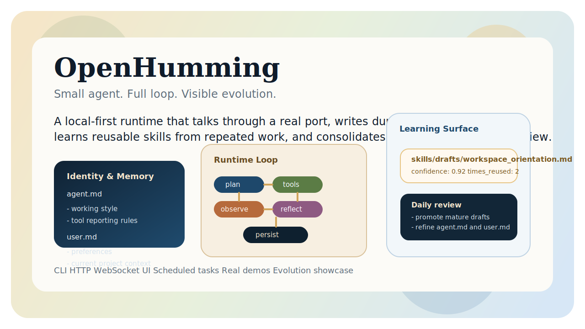
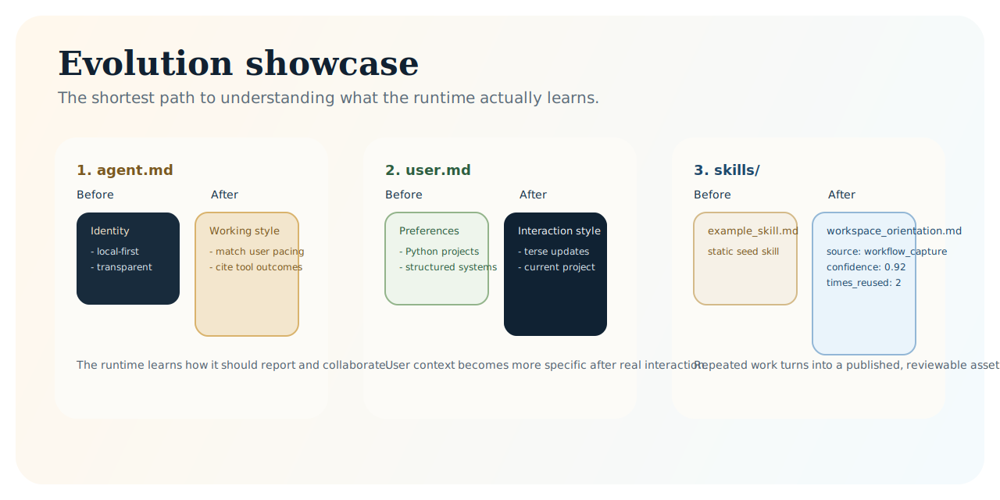
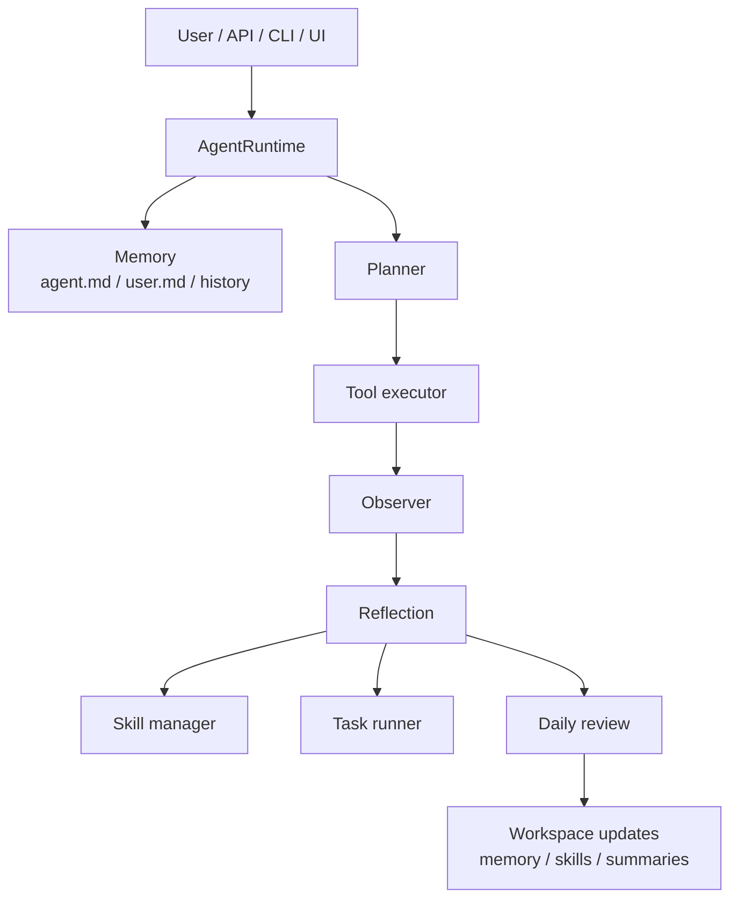

# OpenHumming

[](https://github.com/YuXiang-ZhuanSun/OpenHumming/actions/workflows/ci.yml)
[](https://www.python.org/)
[](https://github.com/YuXiang-ZhuanSun/OpenHumming/blob/main/LICENSE)
[](https://github.com/YuXiang-ZhuanSun/OpenHumming/tags)

English | [简体中文](README.zh-CN.md)



> Small agent. Full loop.
>
> 本地优先，会对话、会记忆、会学习、会沉淀的 agent runtime。

OpenHumming is a local-first Python agent runtime built around visible files instead of hidden state.
It keeps talking, keeps recording, keeps learning, and turns repeated work into reusable skills inside a readable workspace.

## Why It Feels Different

- `agent.md` stores durable runtime identity and working style.
- `user.md` stores durable user preferences and project context.
- `skills/` stores reusable published workflows, with nested folders available as skill extension packs.
- `skills/drafts/` stores newly learned workflows waiting for daily review.
- `tasks/` stores recurring prompts plus run logs.
- `conversations/`, `traces/`, and `summaries/` make the runtime inspectable instead of mysterious.

Most agent projects still feel like prompt wrappers.
OpenHumming aims to feel like a living local system:

- markdown memory instead of hidden database state
- a real runtime loop with planning, tools, observation, reflection, and persistence
- workflow capture that can grow into reusable skills
- daily review that updates memory and promotes mature drafts
- a local UI, HTTP API, CLI, and WebSocket entrypoint for the same runtime

## What Ships In v1.0.0

- A complete local workspace model centered on `agent.md`, `user.md`, skills, tasks, traces, and summaries.
- A continuous conversation loop exposed through CLI, HTTP, WebSocket, and the local `/ui` console.
- Real workspace tools for file reads, file writes, directory inspection, skill reads, and task creation.
- Self-updating memory that can replace stale collaboration preferences instead of only appending new bullets.
- Reuse-aware skill learning: repeated successful workflows update existing drafts with `times_reused` evidence.
- Daily review that consolidates conversations, upgrades memory, reviews draft skills, and promotes strong ones.
- A repeatable real demo suite plus an evolution showcase for `agent.md`, `user.md`, and `skills/`.

## See The Product

- Local console: `http://127.0.0.1:8765/ui`
- Evolution showcase: `GET /showcase/evolution`
- Real demo suite: [examples/real_demos/README.md](examples/real_demos/README.md)
- Showcase guide: [docs/showcase.md](docs/showcase.md)
- Launch kit: [docs/release/README.md](docs/release/README.md)



## 90-Second Tour

```bash
python -m venv .venv
. .venv/bin/activate
pip install -e .[dev]
openhumming init
openhumming serve --host 127.0.0.1 --port 8765
```

Then try the full loop:

```bash
curl -X POST http://127.0.0.1:8765/chat \
  -H "Content-Type: application/json" \
  -d "{\"message\": \"Please read `agent.md`, list the `skills` directory, then turn this workflow into skill: Workspace Orientation\"}"
```

Or run the full real demo suite:

```bash
python scripts/run_real_demos.py
```

## What The Loop Actually Does

1. Load `agent.md`, `user.md`, conversation history, and relevant skills.
2. Build a turn plan from the incoming message.
3. Execute matching tools inside the workspace boundary.
4. Observe tool outcomes and record trace events.
5. Reflect on memory changes and reusable workflow candidates.
6. Persist the turn, then let daily review consolidate the day.



## Workspace Layout

```txt
workspace/
|-- agent.md
|-- user.md
|-- conversations/
|-- skills/
|   |-- drafts/
|   `-- extensions/
|-- summaries/
|-- tasks/
|   `-- runs/
|-- files/
`-- traces/
```

This is the product philosophy in one tree: files you can inspect, diff, edit, and carry between machines.

## Repository Layout

```txt
openhumming/
|-- agent/        # runtime loop, planner, execution, reflection
|-- cli/          # Typer commands
|-- config/       # settings and logging
|-- llm/          # provider abstraction
|-- memory/       # durable profiles, conversation store, daily review
|-- scheduler/    # task parsing, scheduling, run logging
|-- server/       # FastAPI app, local UI, routes, showcase
|-- skills/       # loading, drafting, reuse tracking, promotion
|-- tools/        # tool protocol and built-ins
|-- trace/        # event recording
`-- workspace/    # path helpers and initialization
```

## Local Interfaces

- `openhumming chat`
- `openhumming serve`
- `POST /chat`
- `GET /memory/agent`
- `GET /memory/user`
- `GET /skills`
- `GET /skills/drafts`
- `POST /skills`
- `GET /tasks`
- `POST /tasks`
- `POST /reviews/daily`
- `GET /settings/provider`
- `POST /settings/provider`
- `GET /showcase/evolution`
- `GET /ui`
- `GET /ws/chat`

## Release Story

OpenHumming v1.0.0 is the point where the project stops looking like a scaffold and starts looking like a complete local agent product:

- the runtime can talk through a real local port
- the workspace shows how the system changes over time
- repeated work can become reusable skills
- daily review pushes durable learnings back into memory
- launch materials, showcase assets, and a repeatable demo suite are included in-repo

See the release assets:

- [CHANGELOG.md](CHANGELOG.md)
- [docs/release/v1.0.0-release-notes.md](docs/release/v1.0.0-release-notes.md)
- [docs/release/v1.0.0-demo-script.md](docs/release/v1.0.0-demo-script.md)
- [docs/release/v1.0.0-social-copy.md](docs/release/v1.0.0-social-copy.md)
- [docs/release/v1.0.0-pr-body.md](docs/release/v1.0.0-pr-body.md)

## Documentation

- [docs/architecture.md](docs/architecture.md)
- [docs/api.md](docs/api.md)
- [docs/memory-system.md](docs/memory-system.md)
- [docs/skill-system.md](docs/skill-system.md)
- [docs/scheduler.md](docs/scheduler.md)
- [docs/roadmap.md](docs/roadmap.md)
- [docs/showcase.md](docs/showcase.md)

## Development

```bash
python -m pip install -e .[dev]
python -m ruff check .
python -m pytest -q
python -m build
```

Latest validation target:

- `python -m pytest -q`
- `python -m ruff check .`
- `python -m build`
