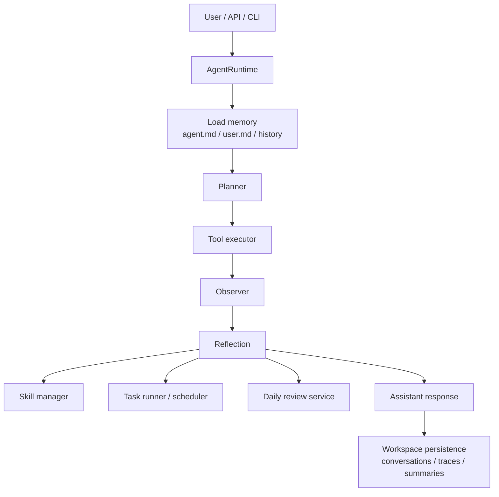

# OpenHumming

[](https://github.com/YuXiang-ZhuanSun/OpenHumming/actions/workflows/ci.yml)
[](https://www.python.org/)
[](https://github.com/YuXiang-ZhuanSun/OpenHumming/blob/main/LICENSE)
[](https://github.com/YuXiang-ZhuanSun/OpenHumming/tags)

> Small agent. Full loop.

OpenHumming is a local-first Python agent runtime that keeps talking, keeps
recording, keeps learning, and keeps turning repeated work into reusable
skills.

It is built around a readable workspace instead of a black box:

- `agent.md` stores the agent identity.
- `user.md` stores durable user preferences.
- `skills/` stores reusable markdown workflows.
- `tasks.json` stores natural-language scheduled tasks.
- `conversations/` and `traces/` store what the runtime actually did.

## Why OpenHumming

Most "agent frameworks" still feel like prompt wrappers. OpenHumming is
different in a few specific ways:

- Local-first by default, with a deterministic provider for offline development.
- Markdown-native memory that stays editable by humans.
- A real agent loop with planning, tool use, observation, reflection, and persistence.
- Skill retrieval for reusable workflows.
- Skill creation from completed multi-step work.
- Built-in scheduler and daily review loop.
- Trace files that make actions inspectable after the fact.

## What Ships Today

The repository currently covers the roadmap from `v0.1` through `v0.6`:

- Chat over CLI, HTTP, and WebSocket.
- Workspace file tools wired into the agent loop.
- Skill retrieval and prompt injection.
- Automatic skill drafting from reusable workflows.
- Background scheduled task execution with run logs.
- Daily review summaries with profile updates.
- Test, lint, and build automation through GitHub Actions.

## Architecture



The runtime loop is documented in [docs/architecture.md](/C:/Users/Xiang/Downloads/projects/SwiftAgent/docs/architecture.md).

## Quickstart

```bash
python -m venv .venv
. .venv/bin/activate
pip install -e .[dev]
openhumming init
openhumming serve
```

Open a second terminal:

```bash
curl -X POST http://127.0.0.1:8765/chat \
  -H "Content-Type: application/json" \
  -d "{\"message\": \"Help me summarize the goals of OpenHumming\"}"
```

Or stay local-first with the CLI:

```bash
openhumming chat
openhumming daily-review
```

## Core Commands

```bash
openhumming init
openhumming serve --host 127.0.0.1 --port 8765
openhumming chat
openhumming daily-review
```

## Workspace Layout

```txt
workspace/
|-- agent.md
|-- user.md
|-- conversations/
|-- summaries/
|-- skills/
|-- tasks/
|-- files/
`-- traces/
```

This is intentional: OpenHumming prefers files you can inspect, diff, edit, and
carry between machines.

## Repository Layout

```txt
openhumming/
|-- agent/        # runtime loop, planner, execution, reflection
|-- cli/          # Typer commands
|-- config/       # settings and logging
|-- llm/          # provider abstraction
|-- memory/       # profiles, conversation store, daily review
|-- scheduler/    # task parsing, scheduling, run logging
|-- server/       # FastAPI app and routes
|-- skills/       # skill loading, retrieval, and creation
|-- tools/        # tool protocol and built-ins
|-- trace/        # event recording
`-- workspace/    # path helpers and initialization
```

## API Surface

- `POST /chat`
- `GET /skills`
- `POST /skills`
- `GET /tasks`
- `POST /tasks`
- `POST /reviews/daily`
- `GET /memory/agent`
- `GET /memory/user`

See [docs/api.md](/C:/Users/Xiang/Downloads/projects/SwiftAgent/docs/api.md) for details.

## Development

```bash
python -m pip install -e .[dev]
python -m ruff check .
python -m pytest -q
python -m build
```

## Status

OpenHumming is now at `v0.6.0`.

- `v0.1` Local chat loop
- `v0.2` Tool execution
- `v0.3` Skill-aware runtime
- `v0.4` Automatic skill creation
- `v0.5` Scheduled tasks
- `v0.6` Daily review and memory updates

The remaining `v1.0` work is mostly polish: richer demos, stronger packaging,
and broader ecosystem integrations.

See [docs/roadmap.md](/C:/Users/Xiang/Downloads/projects/SwiftAgent/docs/roadmap.md)
and [CHANGELOG.md](/C:/Users/Xiang/Downloads/projects/SwiftAgent/CHANGELOG.md).
