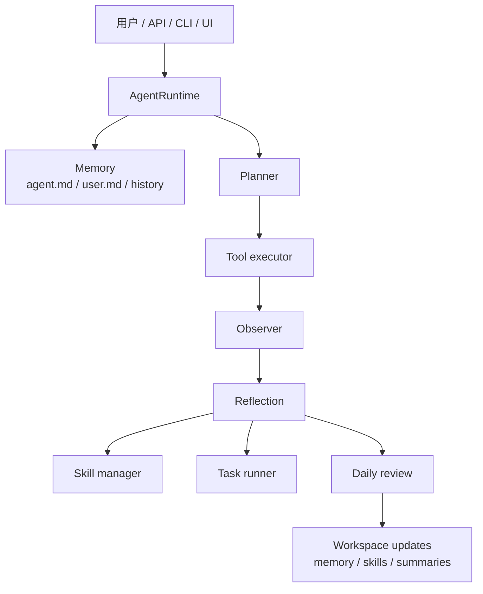

# OpenHumming

[](https://github.com/YuXiang-ZhuanSun/OpenHumming/actions/workflows/ci.yml)
[](https://www.python.org/)
[](https://github.com/YuXiang-ZhuanSun/OpenHumming/blob/main/LICENSE)
[](https://github.com/YuXiang-ZhuanSun/OpenHumming/tags)

[English](README.md) | 简体中文


> 小而完整的 Agent 闭环。
>
> 一个本地优先、会对话、会记忆、会学习、会沉淀的 agent runtime。

OpenHumming 是一个面向真实团队协作的本地优先 Python agent runtime。  
它不是把状态藏进黑盒数据库，也不是只包一层 prompt，而是把重要状态落在你能看见、能 diff、能迁移、能审查的工作区里。

这对中国团队尤其重要：

- 可以直接用 Markdown 读懂 agent 的身份、用户画像和技能库
- 可以按自己的合规、部署和供应商习惯切换本地 / DeepSeek / OpenAI-compatible / OpenAI / Anthropic
- 可以把对话、复盘、技能沉淀放进现有研发流程，而不是另起一套黑盒系统

## 这个项目解决什么问题

多数 agent 项目在演示时看起来很聪明，但一落地就会遇到几个问题：

- 记忆不可见，不知道它到底“记住了什么”
- 工作流不可复用，每次都像第一次做
- 对话结束后没有沉淀，第二天还得从头开始
- UI、API、CLI 各做一套，行为还不一致

OpenHumming 的目标就是把这些问题做成一个完整闭环：

- `agent.md` 负责 agent 的长期身份和工作风格
- `user.md` 负责用户偏好和项目上下文
- `skills/` 负责沉淀可复用工作流
- `skills/drafts/` 负责承接新学到、待复盘审核的技能草稿
- `tasks/` 负责定时任务和运行记录
- `conversations/`、`traces/`、`summaries/` 负责把系统真实做过的事留下来

## v1.0.0 已经具备什么

- 完整的本地工作区模型，围绕 `agent.md`、`user.md`、skills、tasks、traces、summaries 组织
- 通过 CLI、HTTP、WebSocket 和本地 `/ui` 页面统一访问同一个运行时
- 读文件、写文件、列目录、读 skill、创建定时任务等真实工具能力
- 会更新记忆，而且不只是追加 bullet，还能用新的协作偏好替换过时设定
- 会从重复成功的工作流里学习，并在 draft 上累积 `times_reused` 证据
- 每日复盘可以汇总对话、更新记忆、审核技能草稿并晋升成熟 skill
- 内置真实 demo 套件和 evolution showcase，方便你向团队、老板、社区解释它到底“学会了什么”

## 先看效果

- 本地控制台：`http://127.0.0.1:8765/ui`
- 演化展示：`GET /showcase/evolution`
- 真实 demo 套件：[examples/real_demos/README.md](examples/real_demos/README.md)
- Showcase 说明：[docs/showcase.md](docs/showcase.md)
- 发布素材包：[docs/release/README.md](docs/release/README.md)


## 90 秒启动

```bash
python -m venv .venv
. .venv/bin/activate
pip install -e .[dev]
openhumming init
openhumming serve --host 127.0.0.1 --port 8765
```

启动后可以直接发一个完整工作流请求：

```bash
curl -X POST http://127.0.0.1:8765/chat \
  -H "Content-Type: application/json" \
  -d "{\"message\": \"Please read `agent.md`, list the `skills` directory, then turn this workflow into skill: Workspace Orientation\"}"
```

也可以直接跑内置真实 demo：

```bash
python scripts/run_real_demos.py
```

## 对中国团队更实用的点

### 1. 供应商选择更灵活

项目支持：

- `local`
- `deepseek`
- `openai_compatible`
- `openai`
- `anthropic`

而且本地 `/ui` 已经支持切换 provider，不需要每次都手改 `.env`。

### 2. 状态可审查

团队协作时，最怕 agent“偷偷记住了什么”。  
OpenHumming 把关键状态直接写进工作区文件，你可以像审普通项目资产一样审它。

### 3. 适合沉淀团队工作流

如果你们团队经常重复做一些复杂事情，比如：

- 初始化项目结构
- 读代码并生成排查路径
- 把一个多步操作固化成排障流程
- 每天自动总结对话并刷新团队上下文

这套 runtime 可以把它们逐步沉淀成 skill，而不是每次都重新 prompt。

## 运行时闭环到底是什么

每一轮对话大致会经过这几个步骤：

1. 读取 `agent.md`、`user.md`、历史记录和相关 skills
2. 根据消息构建本轮 plan
3. 在工作区边界内执行工具
4. 观察工具结果并记录 trace
5. 反思这轮是否该更新记忆、是否值得学习成 workflow draft
6. 把结果持久化，交给 daily review 继续沉淀



## 工作区结构

```txt
workspace/
|-- agent.md
|-- user.md
|-- conversations/
|-- skills/
|   |-- drafts/
|   `-- extensions/
|-- summaries/
|-- tasks/
|   `-- runs/
|-- files/
`-- traces/
```

这棵目录树本身就是产品哲学：  
agent 不应该只“回答”，还应该留下可以检查和复用的资产。

## 仓库结构

```txt
openhumming/
|-- agent/        # 运行时主循环、规划、执行、反思
|-- cli/          # Typer 命令行入口
|-- config/       # 配置和日志
|-- llm/          # provider 抽象层
|-- memory/       # 持久画像、对话存储、daily review
|-- scheduler/    # 定时任务解析、调度、运行日志
|-- server/       # FastAPI、本地 UI、路由、showcase
|-- skills/       # skill 加载、起草、复用追踪、晋升
|-- tools/        # 工具协议和内置工具
|-- trace/        # 事件记录
`-- workspace/    # 工作区路径和初始化
```

## 对外接口

- `openhumming chat`
- `openhumming serve`
- `POST /chat`
- `GET /memory/agent`
- `GET /memory/user`
- `GET /skills`
- `GET /skills/drafts`
- `POST /skills`
- `GET /tasks`
- `POST /tasks`
- `POST /reviews/daily`
- `GET /settings/provider`
- `POST /settings/provider`
- `GET /showcase/evolution`
- `GET /ui`
- `GET /ws/chat`

## 为什么它像一个“成熟的 agent 项目”

因为它不只是功能点齐全，而是结构、叙事和资产都已经成体系：

- 目录职责明确
- 对话循环完整
- 记忆有真实写回
- skills 会增长
- 定时任务会触发 runtime 回流
- 每日复盘会继续沉淀系统身份和用户上下文
- GitHub 首页、demo、showcase、release 素材是一整套

## 发布素材

如果你要把它介绍给团队、客户或者社区，可以直接看这些：

- [CHANGELOG.md](CHANGELOG.md)
- [docs/release/v1.0.0-release-notes.md](docs/release/v1.0.0-release-notes.md)
- [docs/release/v1.0.0-demo-script.md](docs/release/v1.0.0-demo-script.md)
- [docs/release/v1.0.0-social-copy.md](docs/release/v1.0.0-social-copy.md)
- [docs/release/v1.0.0-pr-body.md](docs/release/v1.0.0-pr-body.md)

## 文档入口

- [docs/architecture.md](docs/architecture.md)
- [docs/api.md](docs/api.md)
- [docs/memory-system.md](docs/memory-system.md)
- [docs/skill-system.md](docs/skill-system.md)
- [docs/scheduler.md](docs/scheduler.md)
- [docs/roadmap.md](docs/roadmap.md)
- [docs/showcase.md](docs/showcase.md)

## 开发与验证

```bash
python -m pip install -e .[dev]
python -m ruff check .
python -m pytest -q
python -m build
```

当前发布前验证链路：

- `python -m pytest -q`
- `python -m ruff check .`
- `python -m build`
- `python scripts/run_real_demos.py`
