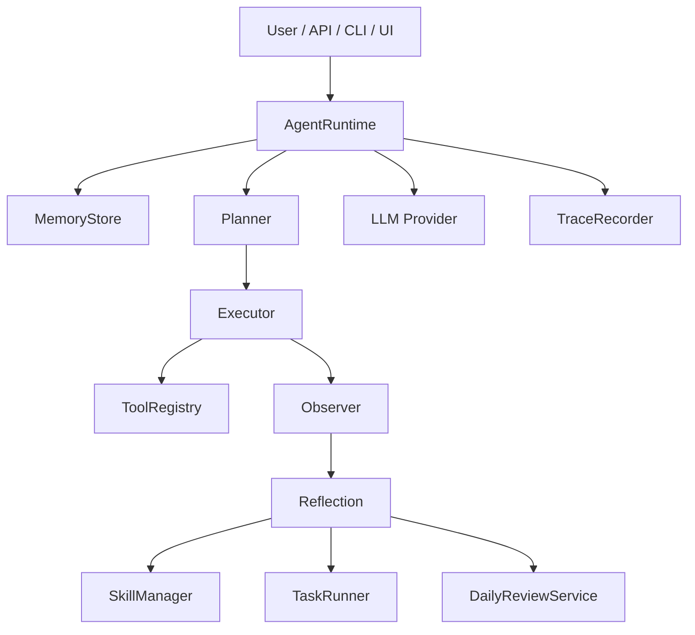

# Architecture / 架构

OpenHumming is organized around a local-first agent loop with visible persistence.  
OpenHumming 围绕一个“本地优先、状态可见”的 Agent 闭环组织起来。

## Runtime Flow / 运行时流程

1. Load workspace context from `agent.md`, `user.md`, history, and relevant skills.  
   从 `agent.md`、`user.md`、历史记录和相关技能加载工作区上下文。
2. Build a turn plan from the incoming user message.  
   根据用户输入构建本轮计划。
3. Execute matching tools inside the workspace boundary.  
   在工作区边界内执行匹配工具。
4. Observe tool results and record trace events.  
   观察工具结果并记录 trace 事件。
5. Reflect on memory proposals and reusable workflow candidates.  
   反思哪些内容应写入记忆，哪些工作流值得沉淀为技能。
6. Persist the turn, then let daily review consolidate the day.  
   持久化本轮结果，再交给 daily review 统一整理当天状态。

## Component Map / 组件图

## Persistence Model / 持久化模型

- `workspace/agent.md`: long-lived agent identity and behavior rules  
  `workspace/agent.md`：长期存在的 Agent 身份与行为规则
- `workspace/user.md`: durable user preferences and project context  
  `workspace/user.md`：长期用户偏好与项目背景
- `workspace/conversations/*.jsonl`: per-turn conversation log  
  `workspace/conversations/*.jsonl`：逐轮对话日志
- `workspace/traces/*.jsonl`: runtime and tool events  
  `workspace/traces/*.jsonl`：运行时与工具事件
- `workspace/skills/*.md`: published reusable skills  
  `workspace/skills/*.md`：正式发布的复用技能
- `workspace/skills/drafts/*.md`: learned drafts pending review  
  `workspace/skills/drafts/*.md`：等待复盘审核的学习草稿
- `workspace/tasks/tasks.json`: scheduled task definitions  
  `workspace/tasks/tasks.json`：定时任务定义
- `workspace/tasks/runs/*.jsonl`: task execution history  
  `workspace/tasks/runs/*.jsonl`：任务执行历史
- `workspace/summaries/*.md`: daily review outputs  
  `workspace/summaries/*.md`：每日复盘输出

## Design Principles / 设计原则

- Local-first execution.  
  本地优先执行。
- Human-readable memory.  
  记忆必须对人类可读。
- Reusable workflow capture.  
  工作流完成后要可沉淀、可复用。
- Review before blind accumulation.  
  先复盘再积累，而不是盲目增长。
- Traceability over hidden reasoning.  
  可追踪性优先于隐藏式推理。
