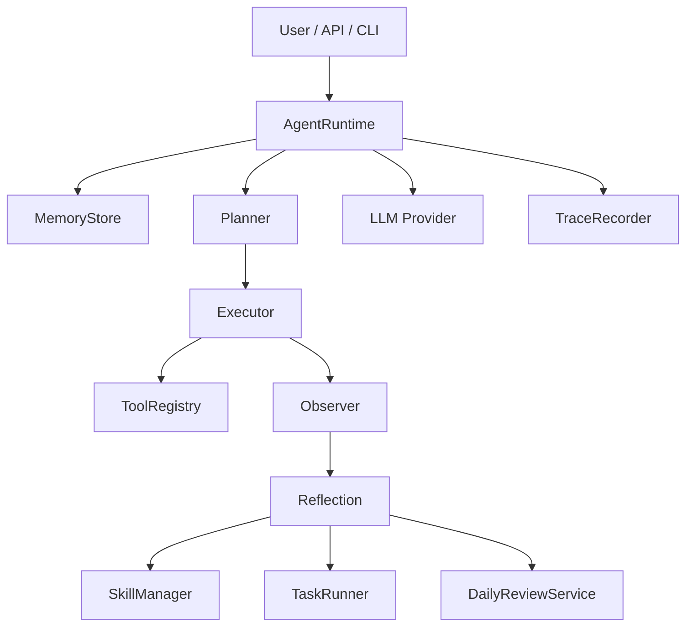

# Architecture

OpenHumming is organized around a simple but complete local-first agent loop.

## Runtime Flow

1. Load workspace context from `agent.md`, `user.md`, conversation history, and relevant skills.
2. Build a turn plan from the incoming user message.
3. Execute any matching tools inside the workspace boundary.
4. Observe tool results and record trace events.
5. Reflect on whether the turn suggests memory, skill, or task updates.
6. Generate the response and persist the completed turn.

## Component Map

## Persistence Model

- `workspace/agent.md`: agent identity and behavior principles
- `workspace/user.md`: durable user preferences
- `workspace/conversations/*.jsonl`: conversation history
- `workspace/traces/*.jsonl`: runtime and tool activity
- `workspace/skills/*.md`: reusable skills
- `workspace/tasks/tasks.json`: scheduled task definitions
- `workspace/tasks/runs/*.jsonl`: scheduler execution history
- `workspace/summaries/*.md`: daily review outputs

## Design Principles

- Local-first execution
- Human-readable memory
- Reusable workflow capture
- Traceability over hidden reasoning
- Small core with clear upgrade paths
